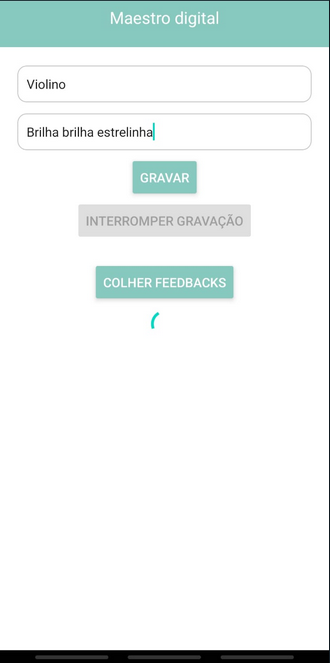
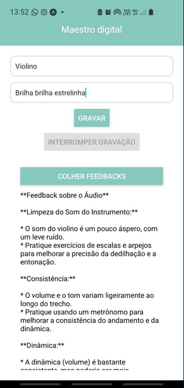

# Projeto Imersão AI Alura + Google

## Sobre o projeto

O Maestro Digital é o aplicativo que transforma seu celular em um professor particular de música, te guiando e te ajudando a alcançar a excelência em seu instrumento.

[assista Ao vídeo](https://www.youtube.com/watch?v=O1eM4tkn99E)

 

### Funcionalidades:

- **Gravação em tempo real**: Toque a música desejada e o Maestro Digital grava sua performance com alta precisão.
- **Análise detalhada**: Receba um feedback completo e personalizado sobre sua execução, incluindo erros de ritmo, entonação e postura.
- **Aprendizado interativo** : Explore exercícios, tutoriais e dicas para aprimorar suas técnicas e habilidades.

## Para rodar o projeto

Após clonar o repositório, rode dentro do diretório:

`npm install`

`npx expo start`

## Para abrir o aplicativo no celular

Primeiro baixe o app `expo.go` no dispositivo, depois basta abrir o aplicativo e clicar em "ler QRCode"

apontar para o QRCode na tela e aproveitar!

**OBSERVAÇÃO: O CELULAR E O COMPUTADOR DEVEM ESTAR CONECTADOS NA MESMA REDE WIFI OU VIA CABO USB**
